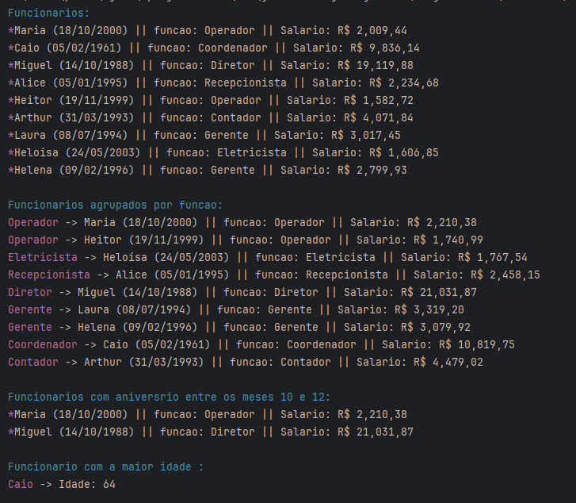

# Projeto Java - Gestão de Funcionários de uma Indústria 🧑‍💻

Este projeto Java tem como objetivo cumprir alguns requisitos.

## 🛠️ Funcionalidades

1. **Inserir Funcionários**: Adiciona funcionários com nome, data de nascimento, salário e função. 💼
2. **Remover Funcionário**: Remove o funcionário "João" da lista. ❌
3. **Exibição de Funcionários**:
    - Imprime os funcionários com informações como nome, data de nascimento (formato `dd/MM/yyyy`), salário formatado e função. 🖨️
4. **Aumento Salarial**: Aplica um aumento de **10%** no salário de todos os funcionários. 💰📈
5. **Agrupamento por Função**: Agrupa os funcionários pela sua função (ex: "Analista", "Gerente", etc.). 👥👔
6. **Filtragem de Aniversários**: Exibe os funcionários que fazem aniversário nos meses 10 (outubro) e 12 (dezembro). 🎂🎉
7. **Funcionário Mais Velho**: Identifica e imprime o funcionário com a maior idade. 👵👴
8. **Ordenação Alfabética**: Imprime a lista de funcionários em ordem alfabética. 🔠
9. **Total de Salários**: Calcula e exibe o total de salários de todos os funcionários. 💸
10. **Salário Mínimo**: Exibe quantos salários mínimos (R$ 1212,00) cada funcionário recebe. 💵

## ⚙️ Como Rodar o Projeto

### Pré-requisitos

Certifique-se de ter o **Java 8 ou superior** instalado em sua máquina. Você pode verificar a versão do Java usando o seguinte comando no terminal:

```bash
java -version
```

### Passos

1. Clone este repositório:
   ```bash
   git clone https://github.com/seu-usuario/projeto-gestao-funcionarios.git
   ```

2. Navegue até o diretório do projeto:
   ```bash
   cd projeto-gestao-funcionarios
   ```

3. Compile e execute o programa com o comando:
   ```bash
   javac Principal.java
   java Principal
   ```

### Exemplo de Saída




## 💡 Tecnologias Utilizadas

- **Java 8+**: Utilizado para a implementação das funcionalidades principais.
- **Streams**: Para manipulação eficiente de coleções.
- **BigDecimal**: Para trabalhar com valores numéricos de forma precisa (salários).

